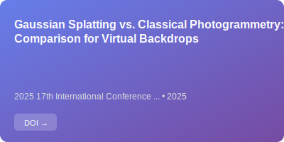

# Hello, I'm Mike 👋  
I'm a **Software & AI Engineer** focused on combining **cutting-edge AI** with strong **software engineering** to build systems that make intelligence practical and usable.

Outside of work, I explore **game development** and **computer graphics**.

## 🚀 My Work  

### 💼 SwissGRC AG  
**Software & AI Engineer**  
Leading AI development and contributing to full-stack engineering across SwissGRC’s products.  
- Architected multi-agent AI assistants
- Built hybrid RAG pipelines with reranking and prompt chaining  
- Developed frontend features (React + TypeScript) and backend APIs (C# ASP.NET)  
- Migrated build processes to Rspack and supported QA, reviews, and onboarding  

### 🧠 My Top Personal Projects

- **[Pheme-AI](#)** – AI-driven trading assistant that scrapes online discussions, analyzes sentiment, and makes investment decisions based on market mood *(2025 · ongoing)*  
- **[Swing Saige Sawyer](https://amaruq.ch/projects/#swing-saige-sawyer)** – Chrome extension that analyzes a live Binance portfolio and suggests swing trades using indicators and LLM judgment *(2025)*  
- **[AI Companion Desktop App](https://amaruq.ch/projects/#ai-companion-desktop-app)** – Local desktop assistant that observes your screen and generates context-aware commentary using screenshot analysis and local LLMs *(2025)*  
- **[During Dusk](https://amaruq.ch/projects/#during-dusk)** – 24-hour Unreal Engine challenge game, a time-trial racer built with UE5 Blueprints, Lumen, and MetaHumans *(2022)*  
- **[EnergizeMe](https://amaruq.ch/projects/#energizeme)** – Arcade game created during vocational school, later released using Unity and C# *(2019)*  

### 📚 Latest Research Publications

*Publications from [ORCID: 0009-0002-7320-1041](https://orcid.org/0009-0002-7320-1041)*
<!-- BEGIN ORCID-CARDS -->
 

<!-- END ORCID-CARDS -->

### 📺 Latest GameDev Videos
*Videos from gamedev youtube: [problemsome](https://www.youtube.com/problemsome)*
<!-- BEGIN YOUTUBE-CARDS -->

[")](https://www.youtube.com/watch?v=kYfX1fg1Z4o)
[")](https://www.youtube.com/watch?v=Qj9imLId1Nc)
<!-- END YOUTUBE-CARDS -->

## 📫 Get in Touch  
📧 [mike@amaruq.ch](mailto:mike@amaruq.ch)  
💼 [linkedin.com/in/mike-pullen](https://linkedin.com/in/mike-pullen)
